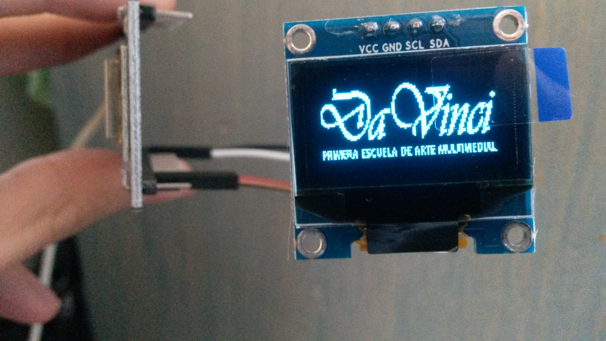

# NodeMCU-Dolar-API [es]
Muestra el valor del dólar oficial y blue en pesos argentinos.

**Instituto** : [Escuela Da Vinci](https://www.davinci.edu.ar)
**Profesor** : Misael Cudek

Código realizado en Arduino IDE para su uso en NodeMCU ESP8266 y pantalla OLED 0.96 I2C para su visualización.

Dentro de la carpeta de documentación se encuentra un PDF donde puede obtener más información sobre: 
- Instalación de software
- Hardware requerido
- Librerías esenciales
- Y más...
(Documentación solamente disponible en español).

# NodeMCU-Dolar-API [en]
Shows the value of the official and blue dollar in argentine peso.

**Institute** : [Da Vinci School](https://www.davinci.edu.ar)
**Professor** : Misael Cudek

Code made in Arduino IDE for use in NodeMCU ESP8266 and OLED 0.96 I2C screen for visualization.

Inside the documentation folder there is a PDF where you can get more information about:
- Software installation
- Required hardware
- Essential libraries
- And more...
(Documentation only available in spanish).

